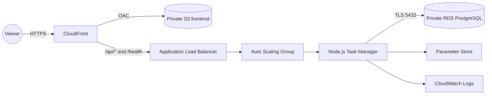

# AWS Cloud Portfolio


Portafolio práctico de arquitectura cloud en AWS, construido de forma incremental con foco en seguridad, costos, automatización, observabilidad e infraestructura reproducible.


## Proyecto destacado


**01 — Web Task Manager**


Una aplicación web pequeña para demostrar una arquitectura AWS profesional. La prioridad no es la complejidad funcional, sino las decisiones de arquitectura, seguridad, despliegue, operación y documentación.


## Principios de trabajo


1. Entender antes de implementar.

2. Evaluar costos antes de crear recursos.

3. Aplicar mínimo privilegio y no guardar secretos en Git.

4. Verificar cada cambio.

5. Documentar decisiones relevantes.

6. Realizar commits pequeños y descriptivos.


## Estado operativo actual


- Frontend privado en S3 distribuido por CloudFront con HTTPS para viewers.

- API Node.js/Express en EC2, administrada por un Auto Scaling Group `min=1`, `desired=1`, `max=2`.

- RDS PostgreSQL privado con TLS, secretos en Parameter Store y acceso operativo por Session Manager.

- Logs de aplicación en CloudWatch, alarma de salud del Target Group y una demostración real de scale-out documentada.

- Repositorio privado sincronizado con GitHub y ADRs/Cost Checks para cada fase relevante.


## Estructura


```text
docs/       Arquitectura, ADRs, runbooks, capturas y controles de costo
projects/   Aplicación y pruebas
scripts/    Automatización PowerShell y AWS CLI
shared/     Artefactos locales no versionados
```

## Arquitectura final



La arquitectura, los límites de seguridad y las mejoras pendientes se describen en [la arquitectura final](docs/architecture/project-01-final-architecture.md).

## Verificación

```powershell
.\scripts\powershell\Test-AwsPortfolioPreflight.ps1 -ProfileName '<aws-cli-profile>'

.\scripts\aws-cli\Test-Project01Observability.ps1 `
  -ProfileName '<aws-cli-profile>' `
  -Region us-east-1 `
  -Execute

.\scripts\aws-cli\Test-Project01CloudFrontDelivery.ps1 `
  -ProfileName '<aws-cli-profile>' `
  -Execute
```

## Documentación operativa

- [Índice de documentación](docs/README.md)
- [Runbook de despliegue](docs/operations/project-01-deployment.md)
- [Runbook de rollback](docs/operations/project-01-rollback.md)
- [Runbook de limpieza](docs/operations/project-01-cleanup.md)
- [Revisión Well-Architected](docs/well-architected/project-01-review.md)

## Costos

El budget es una alerta, no un interruptor automático. RDS, ALB, una EC2, EBS, S3, CloudFront y CloudWatch pueden generar cargos. Billing y Cost Explorer pueden mostrar uso con retraso; revisar el costo real antes de ampliar recursos o dejarlos activos.

## Próximas evoluciones

- Autenticación con Amazon Cognito.
- HTTPS de extremo a extremo CloudFront → ALB con Route 53 y ACM.
- CI/CD con GitHub Actions y OIDC.
- Infraestructura declarativa con Terraform o CloudFormation.
