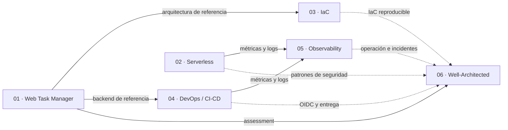
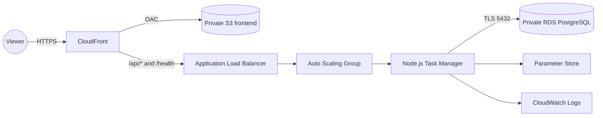

# AWS Cloud Portfolio


Portafolio práctico de arquitectura cloud en AWS, construido de forma
incremental con foco en seguridad, costos, automatización, observabilidad e
infraestructura reproducible. Los seis proyectos están cerrados como
entregables y su evidencia está versionada en este repositorio privado.


## Proyectos del portafolio


**01 — Web Task Manager**


Aplicación web multi-capa que demuestra CloudFront, S3 privado, ALB,
Auto Scaling/EC2, RDS PostgreSQL, Parameter Store y CloudWatch. Está cerrada
como entrega; una auditoría de 2026-09-16 confirmó que el workload permanece
activo para demostración.

**02 — Serverless Link Shortener**

Aplicación serverless cerrada que demuestra API Gateway HTTP API, Lambda, DynamoDB On-Demand, Cognito JWT y CloudWatch, sin servidores ni red privada. Su [documentación de cierre](projects/02-serverless-link-shortener/docs/project-closure.md) conserva la evidencia de validación y el Cost Check final.

**03 — Infrastructure as Code**

Comparación y reconstrucción de la arquitectura de referencia mediante
CloudFormation y Terraform, con validación de templates, planes y una prueba
E2E aislada. Incluye [guía de despliegue y teardown](projects/03-infrastructure-as-code/docs/operations/project-03-deployment-and-teardown-guide.md).

**04 — DevOps / CI-CD**

Pipeline con pruebas Node.js, Docker, GitHub Actions, OIDC, ECR privado y ECS/
Fargate temporal. La [validación GitHub → ECS](projects/04-devops-cicd/docs/validation/github-ecs-cd-validation.md) y sus Cost Checks documentan la extensión temporal.

**05 — CloudWatch / Observability**

Baseline transversal con dashboard, alarmas sin acciones automáticas, Logs
Insights, runbooks e incidente controlado. Su [revisión final](projects/05-cloudwatch-observability/docs/validation/final-project-review.md) separa la demostración de los recursos que aún pueden permanecer activos.

**06 — AWS Well-Architected Case Study**

Assessment de P1 contra los seis pilares de AWS Well-Architected: evidencia,
trade-offs, riesgos, backlog priorizado y arquitectura objetivo no desplegada.
El [informe final](projects/06-well-architected-case-study/docs/assessment/final-case-study.md) cierra el portafolio técnico.


## Principios de trabajo


1. Entender antes de implementar.

2. Evaluar costos antes de crear recursos.

3. Aplicar mínimo privilegio y no guardar secretos en Git.

4. Verificar cada cambio.

5. Documentar decisiones relevantes.

6. Realizar commits pequeños y descriptivos.


## Relación entre proyectos



P1 y P2 son workloads; P3, P4 y P5 demuestran capas de infraestructura,
entrega y operación; P6 convierte la experiencia en una evaluación arquitectónica
con recomendaciones explícitamente no desplegadas.

## Estado operativo y costo

Los proyectos están cerrados como evidencia de portafolio, pero algunos
laboratorios pueden seguir desplegados para demostración. No se debe inferir que
un entorno está apagado solo porque su proyecto esté cerrado: revisar siempre
su Cost Check y runbook antes de pausarlo, recrearlo o eliminarlo.

### Proyecto 1 — workload auditado


- Frontend privado en S3 distribuido por CloudFront con HTTPS para viewers.

- API Node.js/Express en EC2, administrada por un Auto Scaling Group `min=1`, `desired=1`, `max=2`.

- RDS PostgreSQL privado con TLS, secretos en Parameter Store y acceso operativo por Session Manager.

- Logs de aplicación en CloudWatch, alarma de salud del Target Group y una demostración real de scale-out documentada.

- Repositorio privado sincronizado con GitHub y ADRs/Cost Checks para cada fase relevante.


## Estructura


```text
docs/       Arquitectura, ADRs, runbooks, capturas y controles de costo
projects/   Aplicación y pruebas
scripts/    Automatización PowerShell y AWS CLI
shared/     Artefactos locales no versionados
```

## Arquitectura de referencia — Proyecto 1



La arquitectura, los límites de seguridad y las mejoras pendientes se describen en [la arquitectura final](docs/architecture/project-01-final-architecture.md).

## Verificación

```powershell
.\scripts\powershell\Test-AwsPortfolioPreflight.ps1 -ProfileName '<aws-cli-profile>'

.\scripts\aws-cli\Test-Project01Observability.ps1 `
  -ProfileName '<aws-cli-profile>' `
  -Region us-east-1 `
  -Execute

.\scripts\aws-cli\Test-Project01CloudFrontDelivery.ps1 `
  -ProfileName '<aws-cli-profile>' `
  -Execute
```

## Documentación destacada

- [Índice de documentación](docs/README.md)
- [Runbook de despliegue](docs/operations/project-01-deployment.md)
- [Runbook de rollback](docs/operations/project-01-rollback.md)
- [Runbook de limpieza](docs/operations/project-01-cleanup.md)
- [Revisión Well-Architected](docs/well-architected/project-01-review.md)
- [Cierre de Proyecto 2](projects/02-serverless-link-shortener/docs/project-closure.md)
- [CloudFormation vs Terraform](projects/03-infrastructure-as-code/docs/architecture/cloudformation-vs-terraform.md)
- [Cierre operativo de Proyecto 4](projects/04-devops-cicd/docs/operations/project-04-closeout.md)
- [Cost Check final de Proyecto 5](projects/05-cloudwatch-observability/docs/cost-checks/final-cost-check.md)
- [Assessment de pilares de Proyecto 6](projects/06-well-architected-case-study/docs/assessment/pillar-assessment.md)

## Costos

El budget es una alerta, no un interruptor automático. La auditoría P6 de
2026-09-16 confirmó que P1 conserva ASG/EC2, RDS, ALB, CloudFront y logs; estos
componentes pueden generar cargos mientras estén desplegados. Los laboratorios
de P2–P5 tienen sus propios Cost Checks y estrategias de teardown.

Billing y Cost Explorer pueden mostrar uso con retraso. Revisar el costo real,
el alcance y el runbook específico antes de ampliar, pausar o eliminar recursos.

## Evoluciones propuestas, no aplicadas

- Autenticación con Amazon Cognito.
- HTTPS de extremo a extremo CloudFront → ALB con Route 53 y ACM.
- CI/CD con GitHub Actions y OIDC.
- Infraestructura declarativa con Terraform o CloudFormation.

Estas mejoras se mantienen como propuestas para una futura fase. El
[backlog Well-Architected](projects/06-well-architected-case-study/docs/recommendations/improvement-backlog.md)
prioriza identidad, autorización y TLS de origen antes de agregar servicios o
costos recurrentes.
