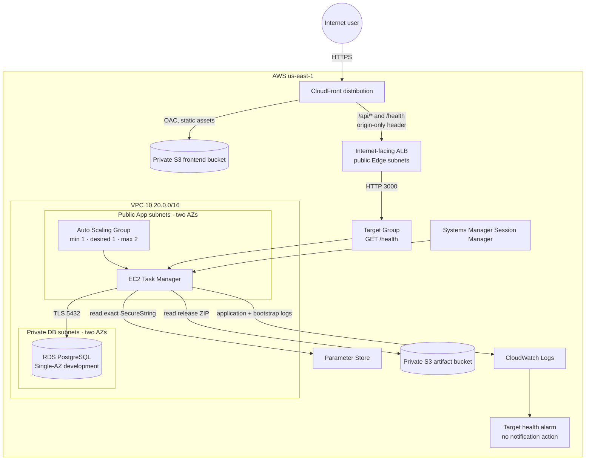

# Project 01 — Final architecture

## Objetivo

Demostrar una aplicación web AWS de varias capas con entrega segura, persistencia privada, operación sin SSH, observabilidad básica y costos conscientemente acotados.

## Diagrama desplegado

## Request and deployment paths

| Flujo | Recorrido | Control principal |
| --- | --- | --- |
| Frontend | Viewer → CloudFront → S3 | S3 privado, Origin Access Control y HTTPS al viewer. |
| API | Viewer → CloudFront → ALB → ASG/EC2 → RDS | CloudFront origin header, ALB health checks, Security Groups y TLS a PostgreSQL. |
| Release | Workstation → private artifact S3 → EC2 | ZIP privado; el role EC2 solo lee `releases/*`. |
| Secret | EC2 role → Parameter Store | Un SecureString de contraseña de aplicación; no está en Git ni en el artefacto. |
| Operación | Operator → Session Manager → EC2 | Sin SSH, key pair ni inbound admin ports. |

## Red y seguridad

| Capa | Diseño actual | Trade-off |
| --- | --- | --- |
| VPC | `10.20.0.0/16`, dos AZ y seis subnets | Se preparan zonas separadas sin desplegar Multi-AZ de RDS en desarrollo. |
| Edge | Dos subnets públicas para ALB | El ALB debe recibir tráfico desde Internet. |
| App | Dos subnets públicas sin inbound directo | La salida a SSM, S3 y repositorios evita NAT Gateway; la aplicación recibe TCP 3000 solo desde ALB. |
| Database | Dos subnets privadas y RDS no público | No existe ruta pública a PostgreSQL. |
| Origin guard | Header secreto CloudFront → ALB; default listener 403 | Bloquea requests directos a nivel L7; el SG del ALB todavía acepta TCP 80. |

## Límites intencionales de desarrollo

- RDS es Single-AZ, tiene un día de backup y deletion protection desactivada.
- El ASG mantiene solo una instancia para limitar costo; dos se usan durante un refresh protegido o una demostración temporal.
- CloudFront llega al ALB por HTTP. HTTPS de extremo a extremo requiere dominio, ACM y listener HTTPS.
- La alarma de salud no usa SNS hasta que exista un destino de notificación explícitamente aprobado.
- No hay autenticación de usuarios; Cognito es una evolución separada.

## Validaciones realizadas

- CRUD PostgreSQL y `/health` desde Session Manager.
- Frontend HTTPS, health y CRUD a través de CloudFront; las tareas de prueba se eliminan.
- CloudWatch Agent activo, streams de bootstrap y aplicación presentes, alarma de health en `OK`.
- Scale-out controlado de una a dos instancias con dos targets sanos; política temporal y alarmas administradas eliminadas después de la demostración.

Las decisiones y costos por fase permanecen en [ADRs](../decisions/) y [Cost Checks](../cost-checks/).
