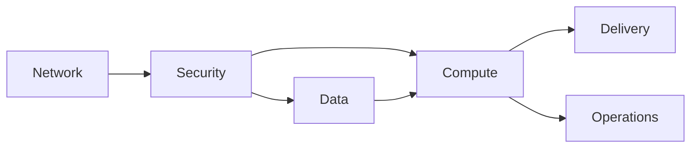

# Alcance de reconstrucción IaC — Proyecto 3

## Fuente arquitectónica

Este proyecto representa la arquitectura final documentada del Proyecto 1. La fuente de verdad funcional es [`docs/architecture/project-01-final-architecture.md`](../../../../docs/architecture/project-01-final-architecture.md). No administra ni altera esa implementación existente.

## Recursos objetivo

| Capa | CloudFormation | Terraform | Diseño que representa |
| --- | --- | --- | --- |
| Network | Stack `network` | Módulo `network` | VPC `10.20.0.0/16`, Internet Gateway, route tables y seis subnets en dos AZ. |
| Security | Stack `security` | Módulo `security` | Security Groups por capa, roles de EC2 y políticas de mínimo privilegio. |
| Data | Stack `data` | Módulo `data` | DB subnet group y RDS PostgreSQL Single-AZ de desarrollo. |
| Compute | Stack `compute` | Módulo `compute` | Launch Template, Target Group, ALB y ASG `min=1`, `desired=1`, `max=2`. |
| Delivery | Stack `delivery` | Módulo `delivery` | Buckets S3 privados, OAC y distribución CloudFront. |
| Operations | Stack `operations` | Módulo `operations` | Log Group, alarma de salud y configuración operativa mínima. |

## Dependencias previstas

CloudFormation usará outputs y parámetros entre stacks. Terraform usará outputs de módulos. La equivalencia será arquitectónica, no una igualdad literal de nombres físicos ni una importación del entorno actual.

## Límites intencionales

- No se crearán NAT Gateway, WAF, Route 53, ACM, Multi-AZ RDS, VPC Flow Logs ni un backend Terraform remoto durante el alcance aprobado.
- Secrets y valores específicos de cuenta se inyectarán solo en tiempo de despliegue, si se aprueba esa fase; no se definen valores reales en templates, parámetros de ejemplo o estado versionado.
- No se desplegará, importará, actualizará ni destruirá infraestructura AWS en la Fase 0.

## Equivalencia y diferencias esperadas

CloudFormation y Terraform deberán expresar los mismos controles: acceso privado a RDS, operación sin SSH, permisos IAM acotados, S3 privado, CloudFront con OAC, ASG reducido y retención corta de logs. Diferencias de sintaxis, estructura de módulos y mecanismos de outputs son parte del aprendizaje y se documentarán en la validación comparativa.
