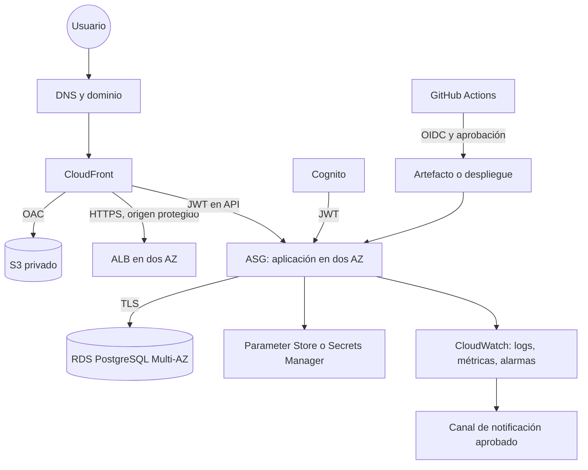

# Arquitectura objetivo — no desplegada

## Propósito

Esta es una evolución de referencia para llevar P1 de laboratorio a un
workload con requisitos de producción. Es una propuesta arquitectónica, no un
plan autorizado de despliegue ni una afirmación de que los componentes existan.

## Cambios respecto a la arquitectura actual

| Área | Actual P1 | Objetivo propuesto | Trade-off |
| --- | --- | --- | --- |
| Identidad | Sin identidad de usuario; root temporal para administración | JWT/ownership y operador de mínimo privilegio | Más configuración y pruebas. |
| Edge/origen | CloudFront → ALB por HTTP | Dominio, ACM y HTTPS de origen | Certificados, DNS y gestión operativa. |
| Aplicación | ASG de capacidad base uno | Capacidad multi-AZ según SLO | Costo recurrente mayor. |
| Base de datos | RDS Single-AZ, un día de backup | Multi-AZ, retención y restore probados | Costo y complejidad mayores. |
| Operación | Logs, health alarm sin acción | SLO, dashboard y notificación con owner | Costos de observabilidad y riesgo de ruido. |
| Entrega | Pasos manuales | CI/CD con OIDC y aprobación | Revisión de permisos y controles de release. |

## Decisiones que requieren una nueva fase

- Si usar Route 53 u otro proveedor DNS.
- Objetivos RTO/RPO y presupuesto para RDS Multi-AZ.
- Patrón de egress para instancias privadas: endpoints, NAT u otra arquitectura.
- Canal de notificación, guardias operativas y retención de telemetría.
- Si WAF es proporcional a la exposición pública y al presupuesto.

No se debe desplegar esta arquitectura por bloques sin Cost Check, plan de
migración, criterios de aceptación y una aprobación explícita por cada recurso
recurrente.
